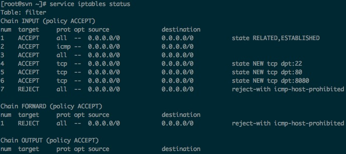
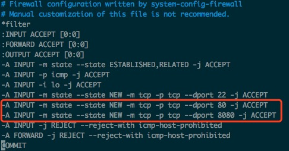

### CentOS配置防火墙操作实例(启、停、开、闭端口)
#### 基本的操作命令
    - 查询防火墙状态
     `service iptables status`
    - 停止防火墙
     `service iptables stop`
    - 启动防火墙
     `service iptables start`
    - 重启防火墙
     `service iptables restart`
    - 永久关闭防火墙 
     `chkconfig iptables off`
    - 永久关闭后启用
     `chkconfig iptables on`
#### 查看防火墙状态
 
### 新增端口,添加8080、80
修改配置文件:`vim /etc/sysconfig/iptables` 
